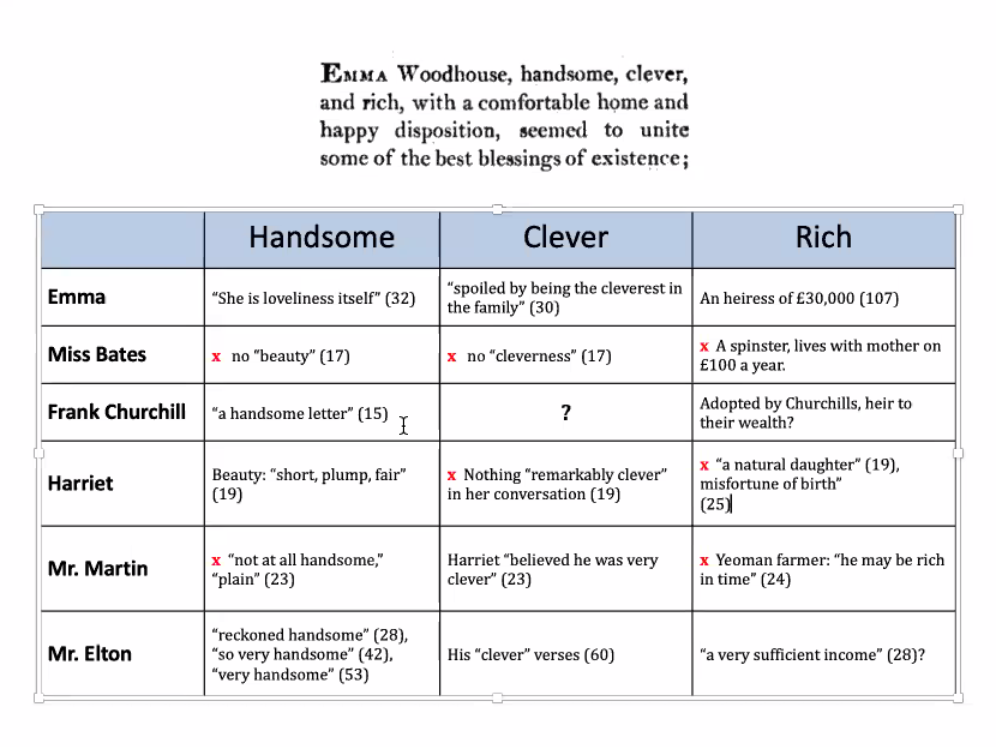

```{r setup, include=FALSE}
knitr::opts_chunk$set(echo = TRUE)
```

## R Jane Austen - Emma

Handsome, Clever, Rich

Tripplets/tripods
2 things close and one thing less connected

Evernone of importance is introduced early

Emma is opposite of Miss Bates

30,000 pounds is almost 3 million pounds today

Emma remakes Harriet
  Clueless - 1990s Harriet
  
Harriet is described as pretty by Emma as beautiful, but this is contrasted by others. (Knightly)

Most people in Jane Austen novels are people of leasure

Jane Austen builds complex social structures



Mr. Martin is the love interest of Harriet
  Harriet thinks him clever, but Jane disagrees
  
## Emma trying to arrange Harriet with Mr. Elton

Emma seems to be a good fit with Frank Churchhill
but, we still don't know much about him, he doesn't show up in first volume

## Free Indirect Discourse
Combines
*Tone* and *word order* from direct discourse
*Tense* and *person* from indirect discourse

Very common in 19th century novels, almost takes over.

## Sentiment over time
Low points of embarassment

## There is a lot of triviality in Jane Austen novels
Especially in Emma
  No real concerns
  
Some read Jane Austen for comfort, but there is a sense of unease
  Mr. Woodhouse as a terribly disfunctional character, fails to see the perspective of others
  
  Jane Austin lived through the french revolution and had brothers in the military, was the more radical?
  
  
Emma is seen as one of her most polished works, possibly one of her best.

## Free indirect discourse
hard to tell who is talking.

narrator isn't saying everything

Indirect
He had returned to a late dinner after some days absence, and now walked up to Hartfield to say that all were well in Brunswick-Square.

Direct
"Emma knows I never flatter her," said Mr. Knightly...
But never did she go without Mr. Woodhouse's giving a gentle sign, and saying: "Ah! Poor Miss Taylor. She would be very glad to stay."

Vol. 1, Chapter 5
Things shift into Dialogue, almost play like.

Free Indirect Discourse
Four Standard Examples:

* How was she going to bear the change? (1.i, p.6)
* The wont of a miss Taylor would be felt every hour of every day.


We often hear the voice of gossip - not a specific name
More complicated Examples of Quasi-Direct Discourse

* "I suppose you have heard of the handsome letter Mr. Frank Churchill had written to Mrs. Weston?" (1.ii, p. 15) [Who says this? - the voice of gossip] - doxa
    * spoken, but not by anybody

* "He had gone three miles one day, in order to bring her some walnuts, because she had said how fond she was of them - and in everything else he was do very obliging!.. (I.iv, p.23) [Indirect quotation?]
  * Emma taking role of narrator,  but still can't remove quotation marks


Easier to capture dialog in texts, harder with free and indirect discourse
Not perfect either way

Finding style of each character

Jane Austen as regulated hatred


## Hacking22-FID.R

```{r Hacking22-FID.R}
# Hacking for Humanists
# 4/14/2020

#################

# From the HW: Sentiment in Emma, plotted

# scan in Emma
# setwd("~/projects/hack/austen")
emma<-scan("austen_emma.txt",what="char",sep="\n")

# chunk by chapter -- note, this should feel like old hat...
chaps.v<-grep("CHAPTER",emma)
emma<-c(emma, "END")
end.v<-length(emma)
chaps.v<-c(chaps.v,end.v)

bagsofwords.l<-list()
vols.chs<-c(paste(1,".",1:18, sep=""), paste(2,".",1:18, sep=""),paste(3,".",1:19, sep=""))
# [1] "1.1"  "1.2"  "1.3"  "1.4"  "1.5"  "1.6"  "1.7"  "1.8"  "1.9"  "1.10" "1.11" "1.12"
# [13] "1.13" "1.14" "1.15" "1.16" "1.17" "1.18" "2.1"  "2.2"  "2.3"  "2.4"  "2.5"  "2.6" 
# [25] "2.7"  "2.8"  "2.9"  "2.10" "2.11" "2.12" "2.13" "2.14" "2.15" "2.16" "2.17" "2.18"
# [37] "3.1"  "3.2"  "3.3"  "3.4"  "3.5"  "3.6"  "3.7"  "3.8"  "3.9"  "3.10" "3.11" "3.12"
# [49] "3.13" "3.14" "3.15" "3.16" "3.17" "3.18" "3.19"

for(i in 1:length(chaps.v)){
        if(i != length(chaps.v)){
                vol.ch<-vols.chs[i]
                start<-chaps.v[i]+1
                end<-chaps.v[i+1]-1
                chaptercontents.v<-emma[start:end]
                chapterwords.v<-tolower(paste(chaptercontents.v, collapse=" "))
                bagofwords.v<-unlist(strsplit(chapterwords.v, "\\W"))
                bagofwords.v<-bagofwords.v[which(bagofwords.v != "")]
                bagsofwords.l[[vol.ch]]<-bagofwords.v
        }
}

str(bagsofwords.l) # chapters chunked into bags of words, organized as a list

# use a tweaked version of Michele Claibourn's function to score sentiment
get_sentiment_afinn <- function(bagofwords){
        result <- sum(dict[which(dict$word %in% bagofwords), "weight"])
        return(result)
}

# Set up the dictionary

dict<-read.delim("sentanalysis/AFINN-111.txt", header=FALSE, stringsAsFactors=FALSE) # reads a tab-separated file into adataframes
names(dict) <- c('word', 'weight')

# apply the get_sentiment_afinn function to the first chapter to test
get_sentiment_afinn(bagsofwords.l[1]) # score is 79, Ok, whatever.

# apply the function to all the chapters in the list of bags of words
chapters.df<-data.frame(sort(sapply(bagsofwords.l,get_sentiment_afinn))) # sorted most negative to least
View(chapters.df) #most negative is vol. III, chapter 14; most positive is volume I, chapter 9. Huh, ok.

# should those scores be normalized for chapter length? Maybe.
# Build a new dataframe
chapters.df<-data.frame(sapply(bagsofwords.l,get_sentiment_afinn))

# make it prettier
library("dplyr")
chapters.df<-add_rownames(chapters.df,"vol.ch")
colnames(chapters.df)[2]<-"AFINNscore"

# add new columns to calculate sentiment score per words in chapter
chapters.df$wordsperchap<-sapply(bagsofwords.l,length)
chapters.df$scoredperwords<-chapters.df$AFINNscore/chapters.df$wordsperchap

View(chapters.df)
# plot it to see sentiment vary over novel
plot(rownames(chapters.df), chapters.df$scoredperwords,
     type="b",
     xaxt="n",
     xlab="Chapters",
     ylab="AFINN Score")
title(main="Sentiment in 'Emma'")
axis(1,at=1:length(rownames(chapters.df)),
     labels=chapters.df$vol.ch,las=2,cex.axis=.6)

################

# For today, some social network analysis...

library("igraph")


# read in information about Emma dialogue
emma.df<-read.table('emma-graph.txt', header=T) # Volume 1, Who speaks to whom?
g <- graph.data.frame(emma.df)

V(g) # vertices, there are 14
E(g) # edges, there are 90
get.edgelist(g)

# A pretty plot? 
# prettier plots: http://igraph.org/r/doc/plot.common.html
par(mai=c(0,0,1,0))
plot(g,    		#the graph to be plotted
     layout=layout.kamada.kawai,	# the layout method. see the igraph documentation for details
     main='"Emma" - Addressed Speech',	#specifies the title
     vertex.size=4,
     edge.arrow.size=.3,
     vertex.label.dist=0.5,			#puts the name labels slightly off the dots
     vertex.frame.color='blue', 		#the color of the border of the dots 
     vertex.label.color='black',		#the color of the name labels
     vertex.label.font=2,			#the font of the name labels
     vertex.label=V(g)$name,		#specifies the labels of the vertices.
     vertex.label.cex=.5			#specifies the size of the font of the labels
)

# plot and save as a PDF
pdf("emmagraph.pdf")
plot(g)
dev.off()

V(g) # 14/14 vertices, named: MrWoodhouse, Emma, MrKnightley, Harriet, MrElton, MissNash, Isabella    
# MrJKnightley, MrWeston ,MrsWeston, Frank, x, MrsBates, MissBates

neighbors(g, V(g)[2], mode = 1) #who does Emma talk to? 
neighbors(g, V(g)[3], mode = 1) #who does Knightley talk to? 

incident(g,V(g)[2], mode=c("all")) # "out", "in", "total"


```
