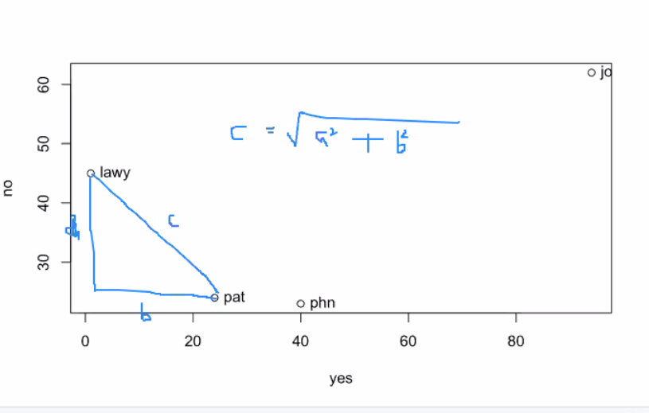

```{r setup, include=FALSE}
knitr::opts_chunk$set(echo = TRUE)
```

## Final???

Pared down from normal

probably ~2 hours. Midterm+

Basically like a homework

R section will be open book

First part will be text identification, from Shakespear, Austen, Blake ~10 of them

Then it will be normal where's waldo, commenting, similar to the mid-term

"I used to go to shonney's and lick the sneeze guard for fun" - Regarding the before time.

## Clustering
Unsupervised Activity

Putting Texts in a pile, can do different things

Might sort shakespear texts into 4 piles, computer puts similar things into same pile.

Today we will look at how this is done.

Mike Whittmore did some, Othello kept showing up with the comeides 

Today we will cluster emma and fan fiction, and some blake.

Can do it where you specify the piles, or let the computer find the number of piles.

## Dendograms - Trees

An alternative way to cluster is K-means clustering

## Today's Functions
dist()
hclust()
seq_along()
prop.table()
mapply()

## The republic of pemberley
Jane Austen fan group
* Collection of fan fiction

Wierd family trees

Lots of characters parented by people who are not their parents

## Back to Yes, yes, No, no
Back to looking at these text from a few classes before.

## To the code!
Shifting from theta to thinking about distance between two points 

Pythagorean Theorem



Distance is scalar, dimensions don't really matter

What is the difference between saying they are similar because they are computationaly near or saying they are near because I read all of the novels and think that.

```{r Hacking24-Clustering.R}
# Hacking, Class 24
# Clustering

# We'll focus on "hierarchical clustering"
# More to read about clustering here: https://www.stat.berkeley.edu/~s133/Cluster2a.html

# 3 texts
# (Yeses, Nos)
pat<-c(24,24)
joy<-c(94,62)
phn<-c(40,23)
lawy<-c(1,45) # adding a text... Imagining the way your lawyer wants you to answer questions...

# a matrix of texts and counts
yes.m<-rbind(pat,joy,phn,lawy)
colnames(yes.m)<-c("yes","no")
plot(yes.m)
text(yes.m,labels=row.names(yes.m),pos=4) # add labels to the points

# calculate distances and cluster
# These distances are all relative
dm<-dist(yes.m) # compressed
dm<-dist(yes.m,diag=T) # 3 x 3

# Class distance
class(dm)
str(dm)

cluster<-hclust(dm)
cluster$labels<-rownames(yes.m)
plot(cluster)
cluster$height # see the distances (maximizes pairwise distance)

# b/c using "complete linkage," builds clusters pairwise based on longest distance 
# between a point in one cluster and in the other. This is the default.

# Compare single linkage, which merges in each step the two clusters whose 
# two closest members have the smallest distance 
cluster2<-hclust(dm,method ="single")
plot(cluster2)
cluster2$height # see distances: note, now using shortest pairwise distances

# More ways to cluster (try also centroid, etc.)
cluster3<-hclust(dm,method ="average")
plot(cluster3)
cluster3$height # note 79.6 is mean of three distances (79.64923,24.41311,102.07840)

```
## Clusters are what we are doing today
So we will be doing clusters today, but with bigger, more complex texts

The treees get harder to read with more than 100 things

## Terminology

Each branch is a clade

Ends are leaves

Things that are most similar have the greatest similarity, harder when comparing across clades

DO NOT read horizontally.

Distances between clusters can be measured largest distance or closest distance

Single Linkage - Closest

Complete Linkage (Default) - Farthest

## Fan Fiction Time

Should ideally be statistically savy when doing stats on the text

```{r}
########################################

# try this with Emma and bits of ivory (following Jockers, chapter 11)

source('Rtools.R') # our tools: using getcorpus(), which I've also 
# pasted in at the bottom of this script

# More bits: from http://pemberley.com/?page_id=5270
bitsofivory<-getcorpus("morebits") # 22 new bits, all emma rewrites
mean(sapply(bitsofivory,length)) # Average length is about 5658 (we'll need this below)

# scan and clean emma
emma.text<-scan("austen_emma.txt",what="char",sep="\n")
emma<-unlist(strsplit(tolower(emma.text),"\\W"))
emma<-emma[which(emma!="")]

# Open the file for consulting (use the file menu)?

# chunk the novel into segments that are 5758 words long 
x<-seq_along(emma)
bitsofemma<-split(emma,ceiling(x/5758)) #returns 29 chunks, last is only 896 words
names(bitsofemma)<-paste0("emma",seq_along(bitsofemma)) #name list elements emma1, emma2, etc.

str(bitsofemma)

# combine all the bits
bits.l<-c(bitsofemma,bitsofivory)

# Our research method: explore the data by clustering.

# get frequency tables for each text.
bits.counts.l<-lapply(bits.l,table) # raw counts

# relative frequency counts
bits.relfreq.l<-lapply(bits.counts.l,prop.table) # relative freqs
# What's prop.table? ask R:
?prop.table # kinda casual, snarky help documentation? And what's a margin.table?!

# Jockers would then convert list of frequency tables to a list of dataframes
bits.df.l<-mapply(data.frame,
                  ID=names(bits.relfreq.l),
                  bits.relfreq.l, SIMPLIFY=FALSE,
                  MoreArgs=list(stringsAsFactors=FALSE)) # I still get factors when I run this mapply
# Getting fanfiction the words and their percentage

# convert to single matrix (in fact, first, a dataframe)
# first bind all dataframes in the lists into a single dataframe
freqs.df<-do.call(rbind,bits.df.l)
rownames(freqs.df)<-NULL

# convert to a wide-form table
# Will be explained next class
# Called a cross tabulation
result<-xtabs(Freq ~ ID+Var1,data=freqs.df)

# convert xtabs table to a matrix
bits.m<-apply(result,2,as.numeric)
dim(bits.m) # 51 9716

# winnow, as necessary
# Throw out not shared words

reduced.m<-bits.m[,apply(bits.m,2,mean)>=.001] # reduced
dim(reduced.m) # 51 143
reduced.m<-bits.m[,apply(bits.m,2,mean)>=.005] # even more reduced...
dim(reduced.m) # 51 32
#row.names(reduced.m)<-names(bits.l) # add document names back in here, or below.

# clustering
dm<-dist(reduced.m)

#dm<-dist(bits.m) # compare bits.m?
cluster<-hclust(dm)
cluster$labels<-names(bits.l)
plot(cluster,hang=-1,cex=.7)

```

Now this is the fun part

```{r}
########################################
# Try just Emma?

# chunk by chapter
# this all, drawing on Jockers textbook...
chaps.v<-grep("CHAPTER",emma.text)
emma.text<-c(emma.text, "END")
end.v<-length(emma.text)
chaps.v<-c(chaps.v,end.v)

chaptersraw.l<-list()
chapterfreqs.l<-list()
vols.chs<-c(paste(1,".",1:18, sep=""), paste(2,".",1:18, sep=""),paste(3,".",1:19, sep=""))

for(i in 1:length(chaps.v)){
  if(i != length(chaps.v)){
    vol.ch<-vols.chs[i]
    start<-chaps.v[i]+1
    end<-chaps.v[i+1]-1
    chaptercontents.v<-emma.text[start:end]
    chapterwords.v<-tolower(paste(chaptercontents.v, collapse=" "))
    chapterwords.l<-strsplit(chapterwords.v, "\\W")
    chapterword.v<-unlist(chapterwords.l)
    chapterword.v<-chapterword.v[which(chapterword.v != "")]
    chapterfreqs.t<-table(chapterword.v)
    chaptersraw.l[[vol.ch]]<-chapterfreqs.t
    chapterfreqs.t.rel<-chapterfreqs.t/sum(chapterfreqs.t)
    chapterfreqs.l[[vol.ch]]<-chapterfreqs.t.rel
  }
}

bitsofemma.df.l<-mapply(data.frame,
                        ID=names(chapterfreqs.l),
                        chapterfreqs.l, SIMPLIFY=FALSE,
                        MoreArgs=list(stringsAsFactors=FALSE))

# a single data frame
emfreqs.df<-do.call(rbind,bitsofemma.df.l)
rownames(emfreqs.df)<-NULL
summary(emfreqs.df$Freq)

emresult<-xtabs(Freq ~ ID+chapterword.v,data=emfreqs.df)
embits.m<-apply(emresult,2,as.numeric)
emreduced.m<-embits.m[,apply(embits.m,2,mean)>=.0025]

# build and plot the cluster
dm<-dist(embits.m)
cluster<-hclust(dm)
cluster$labels<-names(chapterfreqs.l)
plot(cluster, cex=.5)

```

```{r}
########################################
# Try clustering Blake

# setwd("~/projects/hack")
source("RTools.R")

# setwd("~/projects/hack/blake")
songs<-getcorpus("songstitled")

# counts and freqs
songs.counts.l<-lapply(songs,table) # raw counts
songs.relfreq.l<-lapply(songs.counts.l,prop.table) # relative freqs

# convert list of frequency tables to a list of dataframes
songs.df.l<-mapply(data.frame,
                   ID=names(songs),
                   songs.relfreq.l, SIMPLIFY=FALSE,
                   MoreArgs=list(stringsAsFactors=FALSE)) # I still get factors when I run this mapply

# convert to matrix
# first bind all dataframes in the lists into a single dataframe
songfreqs.df<-do.call(rbind,songs.df.l)
rownames(songfreqs.df)<-NULL

# convert to a wide-form table
result<-xtabs(Freq ~ ID+Var1,data=songfreqs.df)

# convert xtabs table to a matrix
songs.m<-apply(result,2,as.numeric)
songsreduced.m<-songs.m[,apply(songs.m,2,mean)>=.0025]

# clustering
dm<-dist(songsreduced.m) # compare songsreduced.m?
cluster<-hclust(dm)
cluster$labels<-names(songs.relfreq.l)
plot(cluster,cex=.8)

```

```{r}
################################################

# In case you can't find your RTools, or don't have a getcorpus function in it:

# This function extracts files from a directory (dir), atomizes as words, 
# and puts them in a list
getcorpus<-function(dir,type=".txt"){
  library(stringr)
  curr.folder<-getwd()
  setwd(dir)
  corpus<-list()
  files<-list.files(pattern=type)
  for(i in 1:length(files)){
    text<-scan(files[i],what="char",sep="\n")
    text<-paste(text,collapse=" ")
    lowertext<-tolower(text)
    text.words<-unlist(str_split(lowertext,boundary("word")))
    text.words<-text.words[which(text.words!="")]
    corpus[[files[i]]]<-text.words
  }
  setwd(curr.folder)
  return(corpus)
}


```

