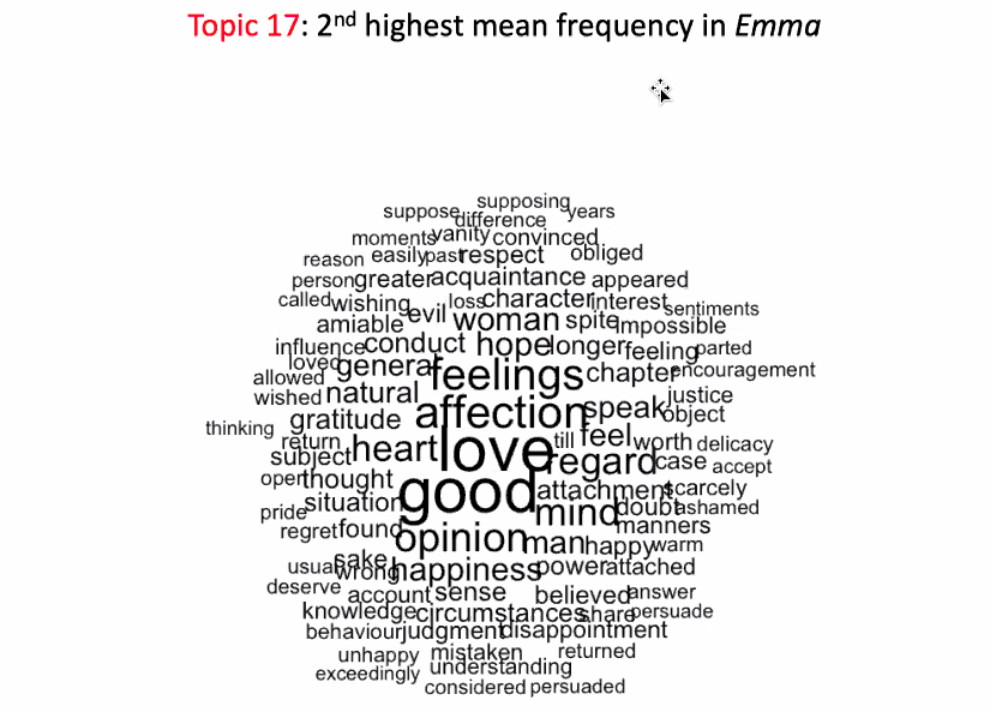

```{r setup, include=FALSE}
knitr::opts_chunk$set(echo = TRUE)
```

## Last Class
A little bit about the final

Sonnets are the poet is speaking

If you know what sonnet or if the sonnet is from Songs of Innocence or Experience, bonus

First part will be similar to the midterm

Part III is a shorter less structured response


## Let's think about visualization


Graph is in 3 sections, Goes down, back up at start of next section, goes done, does the same thing a third time

Can see the parts of the novel in the descents

Wrestle with and try to explain what you see in the graph or visualization


More ambiguous, just start picking at it, look at outliers

Probably would be accompanied by a table labeling the poems

An emma visualization:
https://datamining.typepad.com/data_mining/2011/08/visualizing-jane-austen-part-2.html


Mentions of Frank Churchill in Emma, Each column is a chapter, paragraphs are color coded

We can see the sporadic nature, see some of the flirtation in the back half

Gray streak is his letter




Word cloud, topic modeling
A built up


Network analysis

Frank comes to town, but he is not important
Mr. Knightly, man next door is who she falls for.


Box hill episode
Emma says mean things to Miss Bates

## That's it for visuals

Last question aims to merge R with the English part

Not a full blown essay

Reading from page 79
"This had just taken place ... do every thing for the good of the other."s
The London Knightley's have returned
Smooth surface, emotion beneath

Or not, back to the sentiment graph

Fun to look at Sentiment graph and see if there are parts of the novel that should be higher or lower

3.7 is box hill, a higher point
Emma feels mortified pg 295, regretful, internalising the Frank Knightley voice

The decline after boxhill continues down (3.9)

The language of lowness continues

3.14 is franks letter

https://www.nytimes.com/2020/02/21/movies/emma-jane-austen.html

Jane Austen has to go through social situations to develope sustense and danger

Experimenting with a secure, upper class character and poking at her insecurities

We don't see much of the details of the profession of love. We get so little.

"Wickedly witholding"

Are any of these marriages ultimately happy?

Mr. Knightly moves into Heartfield, still living with Mr. Woodhouse
Mr. Woodhouse can't really let Emma leave

Emma brings someone else into her suffering

What do we make of Mr. Woodhouse, is he funny? 


## Scripts to play with if you want

Will probably go through the finalexam script on Thursday during the review script


```{r Hacking23-GGPlot.R}
# Hacking for Humanists
# GGPlot2
# April 24, 2019

# There's ggplot2 cheatsheet:
# https://www.rstudio.com/wp-content/uploads/2015/12/ggplot2-cheatsheet-2.0.pdf


setwd("~/projects/hack/ggplot")
library(ggplot2)
library(stringr)
source("~/projects/hack/RTools.R") # or open it with file.edit("~/projects/hack/RTools.R")

# Using blakecorpus and songsinorder.df -- let's regenerate these
blakecorpus<-getcorpus("songstitled") 
# If you still don't have getcorpus in a handy place, source it at the bottom of this script!
str(blakecorpus) # list of 46

######################

# Try also with Emma:
# scan in Emma
setwd("~/projects/hack/austen")
emma<-scan("austen-emma.txt",what="char",sep="\n")

# chunk by chapter -- note, this should feel like old hat...
chaps.v<-grep("CHAPTER",emma)
emma<-c(emma, "END")
end.v<-length(emma)
chaps.v<-c(chaps.v,end.v)

bagsofwords.l<-list()
vols.chs<-c(paste(1,".",1:18, sep=""), paste(2,".",1:18, sep=""),paste(3,".",1:19, sep=""))
# [1] "1.1"  "1.2"  "1.3"  "1.4"  "1.5"  "1.6"  "1.7"  "1.8"  "1.9"  "1.10" "1.11" "1.12"
# [13] "1.13" "1.14" "1.15" "1.16" "1.17" "1.18" "2.1"  "2.2"  "2.3"  "2.4"  "2.5"  "2.6" 
# [25] "2.7"  "2.8"  "2.9"  "2.10" "2.11" "2.12" "2.13" "2.14" "2.15" "2.16" "2.17" "2.18"
# [37] "3.1"  "3.2"  "3.3"  "3.4"  "3.5"  "3.6"  "3.7"  "3.8"  "3.9"  "3.10" "3.11" "3.12"
# [49] "3.13" "3.14" "3.15" "3.16" "3.17" "3.18" "3.19"

for(i in 1:length(chaps.v)){
  if(i != length(chaps.v)){
    vol.ch<-vols.chs[i]
    start<-chaps.v[i]+1
    end<-chaps.v[i+1]-1
    chaptercontents.v<-emma[start:end]
    chapterwords.v<-tolower(paste(chaptercontents.v, collapse=" "))
    bagofwords.v<-unlist(strsplit(chapterwords.v, "\\W"))
    bagofwords.v<-bagofwords.v[which(bagofwords.v != "")]
    bagsofwords.l[[vol.ch]]<-bagofwords.v
  }
}

str(bagsofwords.l) # chapters chunked into bags of words, organized as a list

##################

# BLAKE

# Reload dictionary, recreate function
dict<-read.delim("~/projects/hack/sentanalysis/AFINN-111.txt", header=FALSE, stringsAsFactors=FALSE) # reads a tab-separated file into adataframes
names(dict) <- c('word', 'weight')
get_sentiment_afinn <- function(bagofwords){
  result <- sum(dict[which(dict$word %in% bagofwords), "weight"])
  return(result)
}

# Apply the function to the list of texts to get scores
songs.df<-data.frame(AFINNscore = sort(sapply(blakecorpus,get_sentiment_afinn)),
                     wordsperpoem = sapply(blakecorpus,length)
                     )

# Fix sort order in Songs
library("gtools")
songs.df<-songs.df[mixedorder(rownames(songs.df)),] #requires mixedorder() {gtools}

library("tibble")
songs.df<-rownames_to_column(songs.df,"file") # can also use dplyr::add_rownames, deprecated. Hadley Wickham wants us to use tibble

# Label innocence and experience
songs.df<-as.data.frame(append(songs.df,list(book=c(rep("innocence",19),rep("experience",27))), after=1))
View(songs.df)

scenesmovie<-paste0("scene",1:52)
###########################

# EMMA

# apply the get_sentiment_afinn function to the first chapter to test
get_sentiment_afinn(bagsofwords.l[[1]]) # score is 79, Ok, whatever.

# apply the function to all the chapters in the list of bags of words
chapters.df<-data.frame(sort(sapply(bagsofwords.l,get_sentiment_afinn))) # sorted most negative to least
View(chapters.df) #most negative is vol. III, chapter 14; most positive is volume I, chapter 9. Huh, ok.

# should those scores be normalized for chapter length? Maybe.
# Build a new dataframe
chapters.df<-data.frame(sapply(bagsofwords.l,get_sentiment_afinn))

# make it prettier
library("dplyr")
chapters.df<-add_rownames(chapters.df,"vol.ch")
colnames(chapters.df)[2]<-"AFINNscore"

# add new columns to calculate sentiment score per words in chapter
chapters.df$wordsperchap<-sapply(bagsofwords.l,length)
chapters.df$scoredperwords<-chapters.df$AFINNscore/chapters.df$wordsperchap

View(chapters.df)
# plot it to see sentiment vary over novel
plot(rownames(chapters.df), chapters.df$scoredperwords,
     type="b",
     xaxt="n",
     xlab="Chapters",
     ylab="AFINN Score")

lines((chapters.df$scoredperwords)+.01,type=)
title(main="Sentiment in 'Emma'")
axis(1,at=1:length(rownames(chapters.df)),
     labels=chapters.df$vol.ch,las=2,cex.axis=.6)

#################################

# GGPlot2, Some Examples

library("ggplot2")
# OK Play with GGPlot

str(mpg) # some fuel efficiency data that comes bundle with R
ggplot(mpg, aes(displ, hwy, colour = class)) + geom_point() # quick plot

# Use our data
ggplot(songs.df) + geom_point(mapping = aes(x=book,y= AFINNscore)) # compare variance
ggplot(songs.df) + geom_point(mapping = aes(x=book,y= AFINNscore,size=wordsperpoem)) # change size

View(songs.df)
# Scatterplot
ggplot(songs.df) + geom_point(mapping = aes(x=wordsperpoem,y= AFINNscore)) # scatterplot
ggplot(songs.df) + geom_point(mapping = aes(x=wordsperpoem,y= AFINNscore,color=as.factor(book))) #color-coded
ggplot(songs.df) + geom_point(mapping = aes(x=wordsperpoem,y= AFINNscore,color=as.factor(book)))

# Histograms
ggplot(songs.df, aes(x=AFINNscore)) + geom_histogram() #mean(songs.df$AFINNscore) returns 1.130435
ggplot(songs.df, aes(x=wordsperpoem)) + geom_histogram() #mean(songs.df$wordsperpoem) returns 113.3043
ggplot(songs.df, aes(x=wordsperpoem, y=..density..)) + geom_histogram(binwidth=5) # density not counts, -- ask a statistician

# This function extracts files from a directory (dir), atomizes as words, 
# and puts them in a list
getcorpus<-function(dir,type=".txt"){
  curr.folder<-getwd()
  setwd(dir)
  corpus<-list()
  files<-list.files(pattern=type)
  for(i in 1:length(files)){
    text<-scan(files[i],what="char",sep="\n")
    text<-paste(text,collapse=" ")
    lowertext<-tolower(text)
    text.words<-unlist(strsplit(lowertext,"\\W"))
    text.words<-text.words[which(text.words!="")]
    corpus[[files[i]]]<-text.words
  }
  setwd(curr.folder)
  return(corpus)
}
```


```{r Hacking24-ExamPractice.R}
# Exam Practice

##### 1. Predict the class for the following: #----------

class(unlist(strsplit("R is angry and must be propitiated!","\\W")))

class(length(letters))
typeof(length(letters))
str(letters)

class(class(class))

class(cbind(x=1:5,y=10:14))
class(x=1:5)

class(dim(rbind(x=(1:5),y=10:14)))

mymatrix<-rbind(x=(1:5),y=10:14)
class(cbind(mymatrix,letters[1:2]))

class(data.frame(rbind(x=(1:5),y=10:14)))

class(data.frame(rbind(x=1:5,y=10:14))[1:2,3])

df<-data.frame(x=1:5,y=10:14,z=letters[1:5],stringsAsFactors = F)
class(df[2,])
class(df[1:2,])
class(as.matrix(df[,1:2]))
class(df[,2])
class(df[[3]][2]) # bonus, predict what is returned
df[[3]]
df[,3]
df$z
class(df[,3])
class(is.na(df[,3][6]))
dim(df)
col3<-df[,3]
col3[6]

##### 2. Replace NAs with zeroes: #----------

test.m<-matrix(c(2,3,NA,7,NA,2,3,14),4,2)
class(test.m[1,2]) # R does suck!!!
test.m
test.m[is.na(test.m)]<-0

##### 3. Turn the following code snippets into functions: #----------

x<-c(1,3,NA,6)

sum(is.na(x))
# as a function for finding number of NAs:
countNAs<-function(x){
  sum(is.na(x))
}

x / sum(x, na.rm = TRUE)
# as a function for returning weights:
weighter<-function(x){
  x / sum(x, na.rm = TRUE)
}

# Try the first function on the vector a, the second on the vector b
a<-c(NA,1:2,NA,3:4)
countNAs(a)
b<-sample(1:10,5)
weighter(b)

##### 5. Can you hack this? #----------
# Find below some tankas from Harryette Mullen (first two) and Sadakichi Hartmann ()
# The Japanese tanka is a thirty-one-syllable poem, 
# traditionally written in a single unbroken line. A form of waka, 
# Japanese song or verse, tanka translates as "short song."

# Turn these into bags of words. Using intersect(), find words that Mullen, a modern 
# African-American poet, is drawing from the tradition.

# Can you get sentiment scores for these?

tanka1<-"Awakened too early on Saturday morning 
by the song of a mockingbird 
imitating my clock radio alarm.
*
Walking along the green path with buds 
in my ears, too engrossed in the morning news
to listen to the stillness of the garden."

tanka2<-"Don't need picket fences, brick wall, 
or razor wire. Our home's protected by 
prickly pear cactus and thorny bougainvillea.
*
Native or not, you're welcome in our gardens. 
Lavender's dress is not so vibrant as your 
green trousers and purple velour sleeves."

tanka3<-"Winter? Spring? Who knows? 
White buds from the plumtrees wing 
And mingle with the snows. 
No blue skies these flowers bring, 
Yet their fragrance augurs Spring." 

tanka4<-"Oh, were the white waves, 
Far on the glimmering sea 
That the moonshine laves, 
Dream flowers drifting to me,--
I would cull them, love, for thee"

tanka5<-"Moon, somnolent, white, 
Mirrored in a waveless sea, 
What fickle mood of night 
Urged thee from heaven to flee 
And live in the dawnlit sea?" 

tanka6<-"Like mist on the leas, 
Fall gently, oh rain of Spring 
On the orange trees 
That to Ume's casement cling—
Perchance, she'll hear the love-bird sing." 

tanka7<-"Though love has grown cold 
The woods are bright with flowers, 
Why not as of old 
Go to the wildwood bowers 
And dream of--bygone hours!"

tanka8<-"The morning wren sings
I stand in the moonlit dawn
Kimono wrapped close
Last night I made my peace
Now free from all attachments."

##### 6. SHOW ME YOUR ABILITY TO REALLY HACK! #----------

# Wheel of Fortune Before & After
# Write a function that takes two strings, e.g.
s1<-"wheel of fortune"
s2<-"fortune cookie"
# and returns the solution to a "Before and After" puzzle:
# "wheel of fortune cookie"
# Use your function to combine all the phrases in beforeandafters.txt


```

